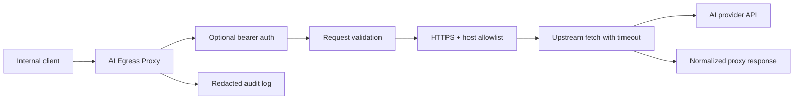

# Architecture

AI Egress Proxy v0 is a single-process Node.js HTTP service.

The architecture favors structural enforcement over behavioral restriction. The service should be a real egress boundary: clients route outbound AI-provider calls through it, and the proxy enforces what is possible with code and configuration.



## Components

- `src/index.ts`: loads configuration and starts the HTTP server.
- `src/config.ts`: parses environment variables into a typed config object.
- `src/server.ts`: owns HTTP routing, request reading, auth, and JSON responses.
- `src/proxy.ts`: validates proxy payloads, applies policy checks, forwards requests, and normalizes upstream responses.
- `src/logging.ts`: redacts sensitive headers and writes structured JSON logs.

## Structural Enforcement

The proxy should enforce policy through mechanisms that do not depend on model obedience or caller convention:

- Egress path: route provider-bound traffic through this service.
- Request contract: accept one explicit proxy payload shape.
- Upstream policy: require HTTPS and allowed hostnames.
- Credential boundary: keep caller authentication and provider credentials distinct.
- Audit boundary: emit logs from the chokepoint rather than relying on clients to self-report.

Prompts, docs, and SDK wrappers may improve ergonomics, but they are not security boundaries. When a policy matters, prefer a server-side or infrastructure-level control.

## Request Flow

1. Caller sends `POST /v1/proxy`.
2. Server checks `PROXY_BEARER_TOKEN` when configured.
3. Server reads the JSON body up to `MAX_REQUEST_BYTES`.
4. Proxy validates URL, method, headers, and body.
5. Proxy rejects non-HTTPS upstreams and hosts outside `ALLOWED_HOSTS`.
6. Proxy strips hop-by-hop headers before forwarding.
7. Proxy aborts the upstream request after `UPSTREAM_TIMEOUT_MS`.
8. Server returns upstream status, safe headers, and body.
9. Server emits redacted audit logs.

## Failure Model

Client errors return 4xx responses with a stable JSON error shape:

```json
{
  "error": {
    "code": "upstream_host_not_allowed",
    "message": "Upstream host is not allowed"
  }
}
```

Unexpected failures return `500` without leaking sensitive implementation details.
