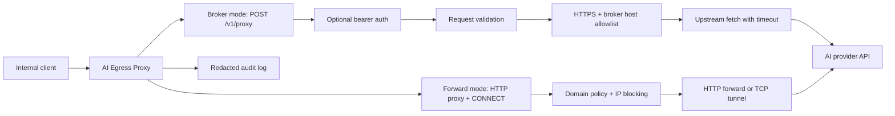

# Architecture

AI Egress Proxy v0 is a single-process Node.js HTTP service with broker and forward proxy modes.

The architecture favors structural enforcement over behavioral restriction. The service should be a real egress boundary: clients route outbound AI-provider calls through it, and the proxy enforces what is possible with code and configuration.



## Components

- `src/index.ts`: loads configuration and starts the HTTP server.
- `src/config.ts`: parses environment variables into a typed config object.
- `src/server.ts`: owns HTTP routing, request reading, broker auth, JSON responses, runtime policy summary, and `CONNECT` event wiring.
- `src/proxy.ts`: implements broker mode by validating JSON proxy payloads, applying broker policy checks, forwarding requests, and normalizing upstream responses.
- `src/forward-proxy.ts`: implements HTTP absolute-form forwarding and HTTPS `CONNECT` tunneling.
- `src/destination-policy.ts`: validates forward proxy destinations, including domain allow/deny policy and private/internal/metadata IP blocking.
- `config/*.example.json`: versionable policy profiles loaded with `AI_EGRESS_PROXY_CONFIG`.
- `src/logging.ts`: redacts sensitive headers and writes structured JSONL audit events to stdout or `AUDIT_LOG_PATH`.

## Structural Enforcement

The proxy should enforce policy through mechanisms that do not depend on model obedience or caller convention:

- Egress path: route provider-bound traffic through this service.
- Request contract: accept one explicit proxy payload shape.
- Broker upstream policy: require HTTPS and allowed hostnames.
- Forward destination policy: validate requested domains and resolved IP addresses before forwarding or tunneling.
- Policy source: prefer reviewable config files for network-boundary policy, with environment variables available as deployment overrides.
- Runtime visibility: expose effective non-secret policy at `GET /policy` so operators can inspect enforced boundaries.
- Credential boundary: keep caller authentication and provider credentials distinct.
- Audit boundary: emit JSONL logs from the chokepoint to stdout or an operator-configured file rather than relying on clients to self-report.

Prompts, docs, and SDK wrappers may improve ergonomics, but they are not security boundaries. When a policy matters, prefer a server-side or infrastructure-level control.

## Broker Request Flow

1. Caller sends `POST /v1/proxy`.
2. Server checks `PROXY_BEARER_TOKEN` when configured.
3. Server reads the JSON body up to `MAX_REQUEST_BYTES`.
4. Proxy validates URL, method, headers, and body.
5. Proxy rejects non-HTTPS upstreams and hosts outside `ALLOWED_HOSTS`.
6. Proxy strips hop-by-hop headers before forwarding.
7. Proxy aborts the upstream request after `UPSTREAM_TIMEOUT_MS`.
8. Server returns upstream status, safe headers, and body.
9. Server emits redacted audit logs.

## Forward Proxy Flow

1. Client configures `HTTP_PROXY` or `HTTPS_PROXY` to point at AI Egress Proxy.
2. HTTP clients send absolute-form HTTP requests, or HTTPS clients send `CONNECT host:port`.
3. Server extracts the destination host and port.
4. HTTP absolute-form requests must use `GET` or `HEAD`; write-like methods are denied by default.
5. HTTPS `CONNECT` requests must target port `443`; other ports are denied by default.
6. Destination policy applies deny rules, allow rules, DNS resolution, and IP range blocking.
7. Denied requests receive structured guidance describing why the request was blocked and what approved path to use.
8. Allowed HTTP requests are forwarded with hop-by-hop proxy headers stripped.
9. Allowed `CONNECT` requests establish a TCP tunnel.
10. Server emits redacted JSONL audit events to stdout or `AUDIT_LOG_PATH`.

## Failure Model

Client errors return 4xx responses with a stable JSON error shape:

```json
{
  "error": {
    "code": "upstream_host_not_allowed",
    "message": "Upstream host is not allowed"
  }
}
```

Forward proxy denials include AI-readable guidance:

```json
{
  "error": {
    "code": "destination_ip_blocked",
    "message": "Destination resolves to a private, internal, loopback, multicast, or metadata IP address",
    "guidance": "Use a public internet destination. Internal networks and metadata services are blocked by design."
  }
}
```

Write-like forward HTTP methods are also denied with guidance:

```json
{
  "error": {
    "code": "forward_http_method_denied",
    "message": "Forward proxy HTTP requests only allow safe read-like methods by default",
    "guidance": "Use GET or HEAD for forward proxy egress. Route write-like API calls through broker mode or ask an operator to add an explicit policy."
  }
}
```

Non-443 `CONNECT` requests are denied with guidance:

```json
{
  "error": {
    "code": "connect_port_denied",
    "message": "HTTPS CONNECT is only allowed to port 443 by default",
    "guidance": "Use CONNECT only for standard HTTPS destinations on port 443. Other ports are denied because CONNECT creates an opaque TCP tunnel."
  }
}
```

Unexpected failures return `500` without leaking sensitive implementation details.
